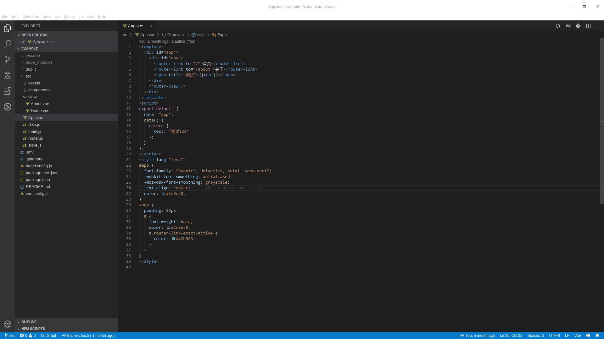

# vue-swift-i18n

[![996.icu][996.icu]][996.icu-url]

A Visual Studio Code extension with rich support for the i18n in Vue,including features such as flating json file or flat json files in a folder,i18n snippets and more !

## Quick Start
1. Install the vue-swift-i18n extension for Visual Studio Code.
2. Open or create a vue project.

## Feature
1. Update  or create a zh-cn.json for i18n with unique key
2. I18n swiftly in a vue or javascript file with zh-cn.json
3. Show the  corresponding value for i18n key in a vue or javascript file
4. Provide showing and jumping hover box for i18n key
5. Flat json or a folder contains json file

## RFC
Warmly welcome to comment feelings when you use and propose the desired features you want.

## License MIT

